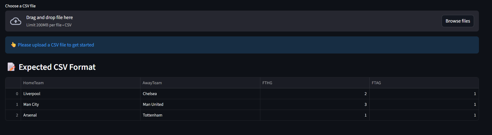
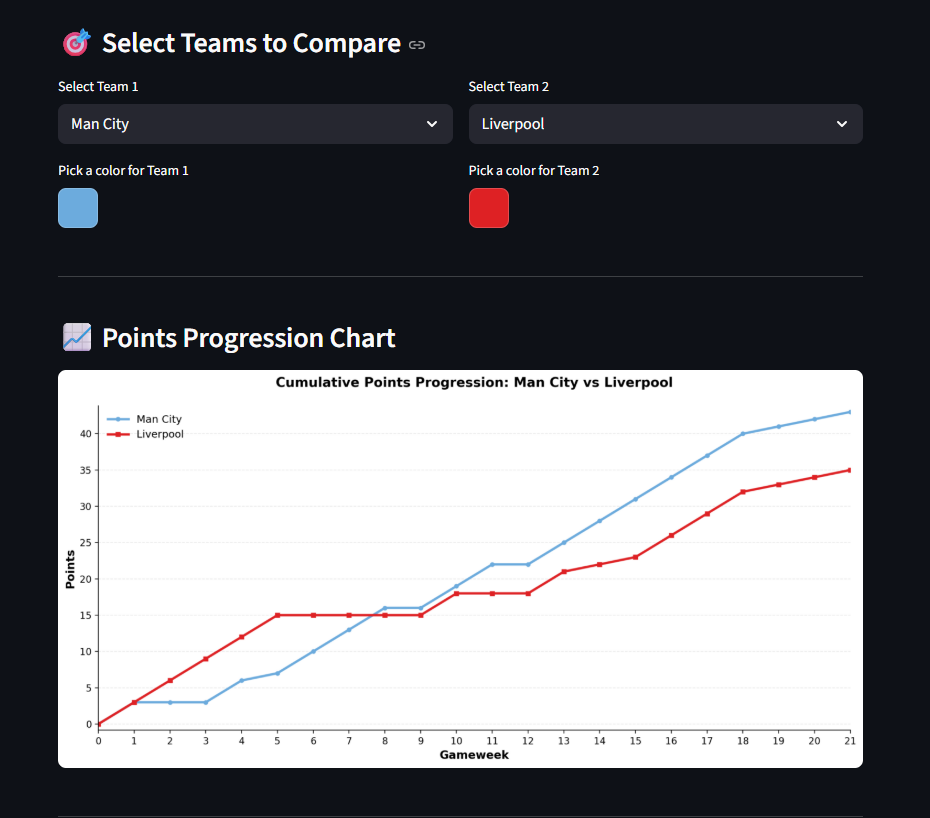

# ⚽ EPL Cumulative Points Tracker

A Streamlit web application for visualizing and comparing team performances throughout an EPL (English Premier League) season. Track cumulative points progression and compare multiple teams with customizable visualizations.

## 📋 Features

- **CSV Upload**: Upload your EPL season match data
- **Two-Team Comparison**: Compare any two teams with customizable colors
- **Multi-Team Analysis**: Compare up to 6 teams simultaneously
- **Visualizations**: Beautiful line charts with matplotlib
- **Statistics Dashboard**: View final points and point differences
- **Custom Color Selection**: Choose your own team colors for better visualization

## 🚀 Quick Start

### Prerequisites

- Python 3.8 or higher
- pip (Python package installer)

### Installation

1. **Clone the repository** (or download the files)
```bash
git https://github.com/Ashipunaz/cumulative-team-points-tracker.git
cd points-tracker-app
```

2. **Install required packages**
```bash
pip install streamlit pandas matplotlib numpy
```

Or use the requirements file:
```bash
pip install -r requirements.txt
```

3. **Run the application**
```bash
streamlit run app.py
```

4. **Open your browser**
   - The app will automatically open at `http://localhost:8501`
   - If not, manually navigate to the URL shown in your terminal

## 📊 CSV File Format

Your CSV file should contain the following columns:

| Column | Description | Example |
|--------|-------------|---------|
| `HomeTeam` | Name of the home team | Liverpool |
| `AwayTeam` | Name of the away team | Chelsea |
| `FTHG` | Full Time Home Goals | 2 |
| `FTAG` | Full Time Away Goals | 1 |

### Example CSV Structure:

```csv
HomeTeam,AwayTeam,FTHG,FTAG
Liverpool,Bournemouth,4,2
Aston Villa,Newcastle,0,0
Brighton,Fulham,1,1
Sunderland,West Ham,3,0
Tottenham,Burnley,3,0
```

**Note**: Your CSV can have additional columns (like Date, Time, etc.), but these four are required for the app to work.

## 🎯 How to Use

### 1. Upload Your Data
- Click "Browse files" or drag and drop your CSV file
- The app will validate that all required columns are present
- Preview your data in the expandable "Preview Dataset" section

### 2. Two-Team Comparison
- Select **Team 1** from the first dropdown
- Pick a color for Team 1 using the color picker
- Select **Team 2** from the second dropdown
- Pick a color for Team 2
- View the comparison chart showing cumulative points over gameweeks
- Check the statistics summary for current/final points and differences

### 3. Multi-Team Comparison
- Scroll to the "Multi-Team Comparison" section
- Select up to 6 teams from the multiselect dropdown
- Customize the color for each selected team
- View all teams on a single chart for comprehensive analysis

## 🛠️ Technical Details

### Dependencies

```txt
streamlit>=1.28.0
pandas>=2.0.0
matplotlib>=3.7.0
numpy>=1.24.0
```

### Key Functions

- `process_team_points(data)`: Processes match data and calculates cumulative points
- `create_comparison_chart()`: Generates matplotlib visualization for two or more teams

### Data Processing Logic

The app follows these rules for calculating points:
- **Win**: 3 points
- **Draw**: 1 point
- **Loss**: 0 points

Points are accumulated cumulatively from gameweek 0 (0 points) to the final gameweek.

## 📸 Screenshots

### Main Interface


### Two-Team Comparison


### Multi-Team Analysis


## 🐛 Known Issues

- Very large CSV files (10,000+ rows) may take longer to process
- Color pickers may not work on some older browsers

## 💡 Tips

1. **Default Colors**: The app provides default team colors, but you can customize them
2. **Gameweek Display**: X-axis always shows integer gameweeks for clarity
3. **Performance**: For best performance, ensure your CSV has clean data with no missing values in required columns

## 👨‍💻 Author

Your Name
- GitHub: [Ashipunaz](https://github.com/Ashipunaz)
- Email: ayubu.oseko@gmail.com

## 🙏 Acknowledgments

- Data for this project was obtained from [Football-Data.co.uk](https://www.football-data.co.uk/)
- Built with [Streamlit](https://streamlit.io/)
- Visualization powered by [Matplotlib](https://matplotlib.org/)

**Enjoy tracking your favorite teams! ⚽📊**
